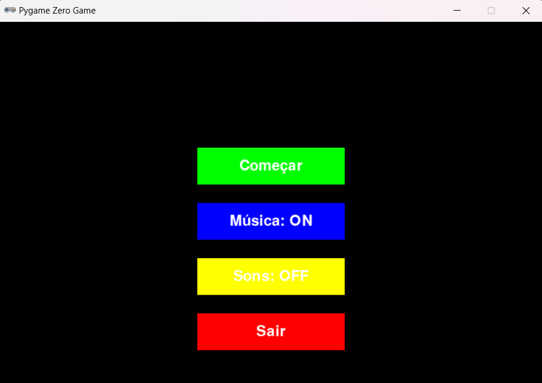
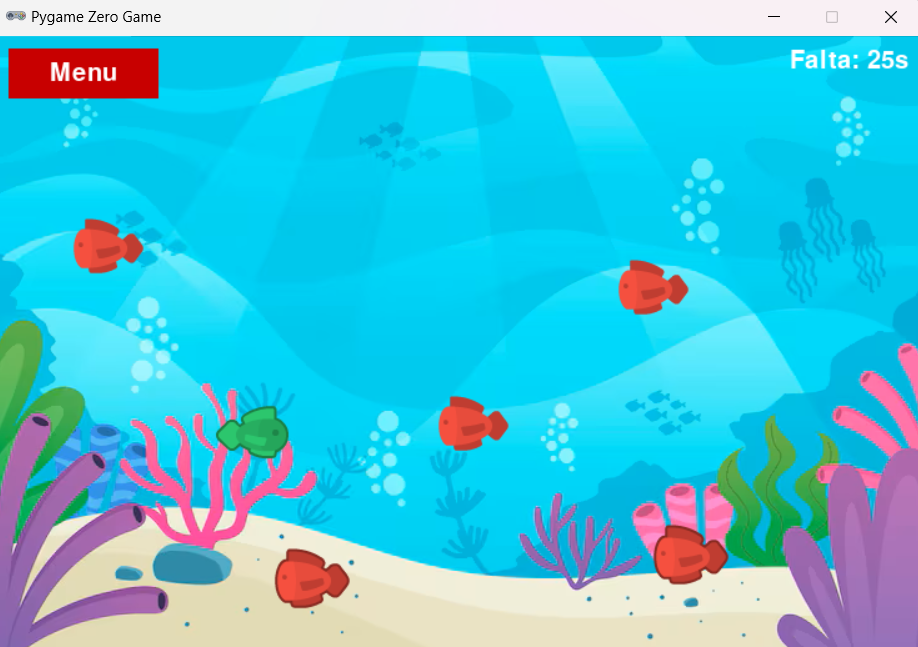

# Fuga das Profundezas by Luciano Almeida

  
*Imagem do menu do jogo*

Fuga das Profundezas é um jogo 2D desenvolvido em Python utilizando a biblioteca **Pygame Zero**. O jogador controla um personagem que precisa sobreviver aos inimigos que aparecem na tela, completando níveis baseados em tempo de sobrevivência.

---

## 🎮 Gameplay

- Sobreviva aos inimigos que surgem aleatoriamente.  
- Cada nível dura **30 segundos**, após os quais o nível é completado.  
- Se colidir com um inimigo, o jogo termina.  

  
*Imagem da tela de jogo*

---

## ⌨️ Controles

- **Setas →, ←, ↑, ↓**: mover o jogador  
- **Mouse**: clicar nos botões do menu e durante o jogo  
  - **Começar**: inicia o jogo  
  - **Música ON/OFF**: ativa/desativa a música de fundo  
  - **Sons ON/OFF**: ativa/desativa efeitos sonoros  
  - **Sair**: fecha o jogo  
  - **Menu**: volta para o menu principal durante o jogo  

---

## ⚙️ Como rodar

1. Certifique-se de ter **Python 3** instalado.  
2. Instale o **Pygame Zero**:
   ```bash
   pip install pgzero
